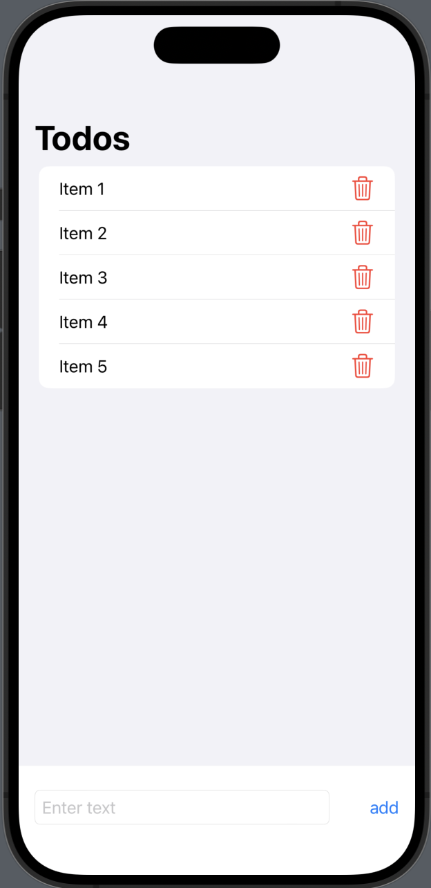

# todolist
# SwiftUI Todo App

A straightforward iOS task management application built with SwiftUI and Swift. This app enables users to create, organize, and manage their tasks efficiently.

## Features

- Add and delete tasks.
- Categorize tasks into projects.
- User-friendly and responsive UI.
- Dark mode support.
- Data persistence using Core Data.

## Getting Started

1. Clone this repository.
2. Open the Xcode project.
3. Build and run the app on an iOS Simulator or a physical iOS device.

## Requirements

- Xcode (12.0 or later)
- iOS 14.0 or later

## Installation

No external dependencies are required. Simply clone the repository and open it in Xcode to get started.

## Usage

- Add tasks by tapping the "add" button.
- Tap to delete tasks.
- Use the project/category picker to organize tasks.
- Mark tasks as complete by tapping the checkbox.

## Contributing

If you'd like to contribute to this project, please fork the repository and create a pull request. We welcome improvements, bug fixes, and new features.

## License

This project is open-source and available under the [MIT License](LICENSE). You can find the full license details in the `LICENSE` file.

## Support

If you encounter any issues or have questions, feel free to open an issue on the GitHub repository or contact the project maintainers.

## Acknowledgments

- This app was developed using SwiftUI, a powerful framework for building iOS applications.
- Core Data was used for data persistence.
- SwiftUI and Xcode make the development process enjoyable and efficient.

Enjoy using the SwiftUI Todo App! Happy coding!

